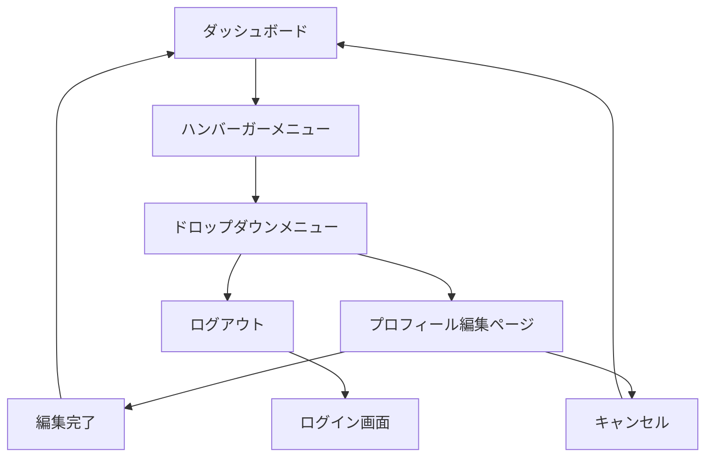

# ユーザープロフィール編集機能実装コマンド

## 概要
ダッシュボードのユーザー情報表示部分を削除し、ヘッダーにユーザー名表示 + ハンバーガーメニューでユーザー編集ページに遷移する機能を実装する。

## 実装順序

### 1. フロントエンド実装

#### 1.1 共通コンポーネント作成
- 共通ヘッダーコンポーネント（Header.tsx）
- ハンバーガーメニューコンポーネント（HamburgerMenu.tsx）
- ドロップダウンメニューコンポーネント（DropdownMenu.tsx）

#### 1.2 ダッシュボード画面の修正
- ユーザー情報表示カード（User Information）を削除
- 共通ヘッダーコンポーネントを使用
- ハンバーガーメニューコンポーネントを統合

#### 1.3 プロフィール編集ページ作成
- ルート：`/profile/edit`
- 共通ヘッダーコンポーネントを使用
- フォーム：ユーザー名、メールアドレス、パスワード変更
- バリデーション実装
- エラーハンドリング

### 2. バックエンド実装

#### 2.1 プロフィール更新API実装
- エンドポイント：`PUT /api/v1/profile`
- リクエストボディ：username, email, current_password, new_password
- バリデーション：一意性チェック、パスワード確認
- レスポンス：更新されたユーザー情報

#### 2.2 バリデーション追加
- ユーザー名：3-20文字、英数字とアンダースコアのみ
- メールアドレス：有効なメール形式
- パスワード：英数字含む8文字以上

## 技術仕様

### フロントエンド
- **フレームワーク**: Next.js
- **状態管理**: React useState
- **フォーム**: 制御コンポーネント
- **バリデーション**: リアルタイム + 送信時
- **スタイリング**: Tailwind CSS
- **コンポーネント構成**:
  - `components/Header.tsx` - 共通ヘッダー
  - `components/HamburgerMenu.tsx` - ハンバーガーメニュー
  - `components/DropdownMenu.tsx` - ドロップダウンメニュー
  - `app/profile/edit/page.tsx` - プロフィール編集ページ

### バックエンド
- **フレームワーク**: Go (net/http)
- **認証**: JWT
- **バリデーション**: go-playground/validator
- **データベース**: PostgreSQL + SQLC

## デザイン仕様

### ヘッダー（Header.tsx）
- 高さ：64px
- 背景：白（#FFFFFF）
- 影：下側に薄い影
- レイアウト：左側（ロゴ + タイトル）、右側（ユーザー名 + ハンバーガーメニュー）
- Props: `showBackButton?: boolean`, `onBackClick?: () => void`

### ハンバーガーメニュー（HamburgerMenu.tsx）
- サイズ：24x24px
- 色：グレー（#6B7280）
- ホバー：ダークグレー（#374151）
- 位置：右上角、padding 16px
- アニメーション：クリック時に回転（90度）
- Props: `isOpen: boolean`, `onToggle: () => void`

### ドロップダウンメニュー（DropdownMenu.tsx）
- 幅：200px
- 背景：白（#FFFFFF）
- 影：ドロップシャドウ（0 4px 6px rgba(0, 0, 0, 0.1)）
- 角丸：8px
- ボーダー：1px solid #E5E7EB
- Props: `isOpen: boolean`, `onClose: () => void`

### プロフィール編集ページ（profile/edit/page.tsx）
- フルページレイアウト
- 共通ヘッダーコンポーネント使用
- 戻るボタン：ヘッダー左側
- フォーム：カード形式、角丸8px
- ボタン：Save（プライマリ）、Cancel（セカンダリ）

## 画面遷移フロー

```
Dashboard → Hamburger Menu → Dropdown Menu → Profile Edit Page
                                                      ↓
                                              Edit Complete → Dashboard
                                                      ↓
                                              Cancel → Dashboard
```

## 実装チェックリスト

### フロントエンド
- [ ] ダッシュボードからユーザー情報表示部分を削除
- [ ] 共通ヘッダーコンポーネント（Header.tsx）作成
- [ ] ハンバーガーメニューコンポーネント（HamburgerMenu.tsx）作成
- [ ] ドロップダウンメニューコンポーネント（DropdownMenu.tsx）作成
- [ ] プロフィール編集ページ（profile/edit/page.tsx）作成
- [ ] フォームバリデーション実装
- [ ] エラーハンドリング実装

### バックエンド
- [ ] プロフィール更新API実装
- [ ] バリデーション追加
- [ ] 一意性チェック実装
- [ ] パスワード確認ロジック実装

## 注意事項

1. **セキュリティ**: パスワード変更時は現在のパスワード確認を必須とする
2. **一意性**: ユーザー名とメールアドレスの一意性チェックを実装
3. **バリデーション**: フロントエンドとバックエンド両方でバリデーションを実装
4. **エラーハンドリング**: ユーザーフレンドリーなエラーメッセージを表示
5. **レスポンシブ**: モバイル対応を考慮したデザイン

## 完了条件

- [ ] ダッシュボードでユーザー情報が表示されない
- [ ] ヘッダーにユーザー名が表示される
- [ ] ハンバーガーメニューからプロフィール編集ページに遷移できる
- [ ] プロフィール編集でユーザー名、メールアドレス、パスワードを変更できる
- [ ] バリデーションが正常に動作する
- [ ] エラーハンドリングが適切に実装されている
- [ ] レスポンシブデザインが適用されている

# 具体
なるほど！ダッシュボードのユーザー情報表示部分は不要で、ハンバーガーメニューの左にユーザー名を表示し、メニューからユーザー編集ページに遷移する仕様ですね。詳しい仕様書を作成します。


[1 tool called]

## �� ユーザー情報編集機能 詳細仕様書

### �� **概要**
ダッシュボードのユーザー情報表示部分を削除し、ヘッダーにユーザー名表示 + ハンバーガーメニューでユーザー編集ページに遷移する仕様に変更。

### 🖥️ **画面レイアウト変更**

#### **1. ダッシュボード画面の変更**
```typescript
// 削除する部分
- ユーザー情報表示カード（User Information）
- User ID、Username、Email の表示

// 残す部分
- ヘッダー（ナビゲーションバー）
- Todo Management セクション（今後実装予定）
```

#### **2. ヘッダー（ナビゲーションバー）の新仕様**
```typescript
// レイアウト構成
┌─────────────────────────────────────────────────────────┐
│ [Logo] Todo App                    [ユーザー名] [☰]     │
└─────────────────────────────────────────────────────────┘

// 要素詳細
- 左側: アプリロゴ + "Todo App" タイトル
- 右側: ユーザー名 + ハンバーガーメニューアイコン
- 高さ: 64px
- 背景: 白（#FFFFFF）
- 影: 下側に薄い影
```

### �� **ハンバーガーメニュー仕様**

#### **1. メニューアイコン**
```typescript
// デザイン
- サイズ: 24x24px
- 色: グレー（#6B7280）
- ホバー: ダークグレー（#374151）
- 位置: ヘッダー右端、padding 16px
- アニメーション: クリック時に回転（90度）
```

#### **2. ドロップダウンメニュー**
```typescript
// レイアウト
- 位置: ハンバーガーメニューの下、右寄せ
- 幅: 200px
- 背景: 白（#FFFFFF）
- 影: ドロップシャドウ（0 4px 6px rgba(0, 0, 0, 0.1)）
- 角丸: 8px
- ボーダー: 1px solid #E5E7EB

// メニュー項目
┌─────────────────────┐
│ 👤 Edit Profile     │
│ ─────────────────── │
│ 🚪 Logout           │
└─────────────────────┘
```

### 📄 **プロフィール編集ページ仕様**

#### **1. ページ構成**
```typescript
// ルート: /profile/edit
// レイアウト: フルページ（共通ヘッダーコンポーネント使用）
// 戻るボタン: ヘッダー左側に「← Back」ボタン
```

#### **2. フォーム構成**
```typescript
// フォームレイアウト
┌─────────────────────────────────────┐
│ ← Back    Todo App    [Username] ☰ │
├─────────────────────────────────────┤
│                                     │
│ Edit Profile                        │
│                                     │
│ ┌─────────────────────────────────┐ │
│ │ Username                        │ │
│ │ [Current username]              │ │
│ │ [New username input]            │ │
│ └─────────────────────────────────┘ │
│                                     │
│ ┌─────────────────────────────────┐ │
│ │ Email Address                   │ │
│ │ [Current email address]         │ │
│ │ [New email address input]       │ │
│ └─────────────────────────────────┘ │
│                                     │
│ ┌─────────────────────────────────┐ │
│ │ Change Password                 │ │
│ │ [Current password input]        │ │
│ │ [New password input]            │ │
│ │ [Confirm new password input]    │ │
│ └─────────────────────────────────┘ │
│                                     │
│ [Save] [Cancel]                     │
│                                     │
└─────────────────────────────────────┘
```

### �� **技術仕様**

#### **1. バックエンドAPI**
```go
// エンドポイント
PUT /api/v1/profile

// リクエストボディ
{
  "username": "新しいユーザー名",
  "email": "新しいメールアドレス",
  "current_password": "現在のパスワード",
  "new_password": "新しいパスワード"
}

// レスポンス
{
  "status": "success",
  "message": "Profile updated successfully",
  "user": {
    "id": 1,
    "username": "new_username",
    "email": "new_email@example.com"
  }
}
```

#### **2. バリデーション**
```typescript
// ユーザー名
- 3-20文字
- 英数字とアンダースコアのみ
- 一意性チェック

// メールアドレス
- 有効なメール形式
- 一意性チェック

// パスワード
- 英数字含む8文字以上
- 現在のパスワードとの一致確認
- 新パスワードと確認パスワードの一致
```

### 📱 **画面遷移フロー**



### 🎨 **デザイン詳細**

#### **1. カラーパレット**
```css
/* プライマリ */
--primary: #3B82F6 (青)
--primary-hover: #2563EB

/* セカンダリ */
--secondary: #6B7280 (グレー)
--secondary-hover: #374151

/* 背景 */
--bg-white: #FFFFFF
--bg-gray: #F9FAFB

/* テキスト */
--text-primary: #111827
--text-secondary: #6B7280
--text-muted: #9CA3AF

/* ボーダー */
--border: #E5E7EB
--border-focus: #3B82F6
```

#### **2. フォント**
```css
/* ヘッダー */
font-family: 'Inter', sans-serif
font-size: 18px
font-weight: 600

/* フォームラベル */
font-size: 14px
font-weight: 500

/* 入力フィールド */
font-size: 16px
font-weight: 400
```

### 📋 **実装チェックリスト**

#### **フロントエンド**
- [ ] ダッシュボードからユーザー情報表示部分を削除
- [ ] 共通ヘッダーコンポーネント作成
- [ ] ハンバーガーメニューコンポーネント作成
- [ ] ドロップダウンメニューコンポーネント作成
- [ ] プロフィール編集ページ作成
- [ ] フォームバリデーション実装
- [ ] エラーハンドリング実装

#### **バックエンド**
- [ ] プロフィール更新API実装
- [ ] バリデーション追加
- [ ] 一意性チェック実装
- [ ] パスワード確認ロジック実装

この仕様で実装を進めてよろしいでしょうか？
