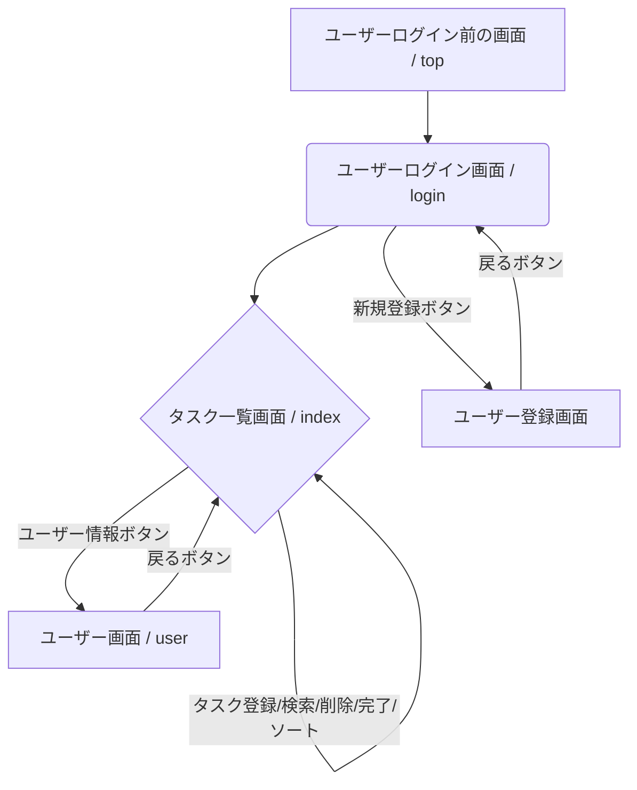
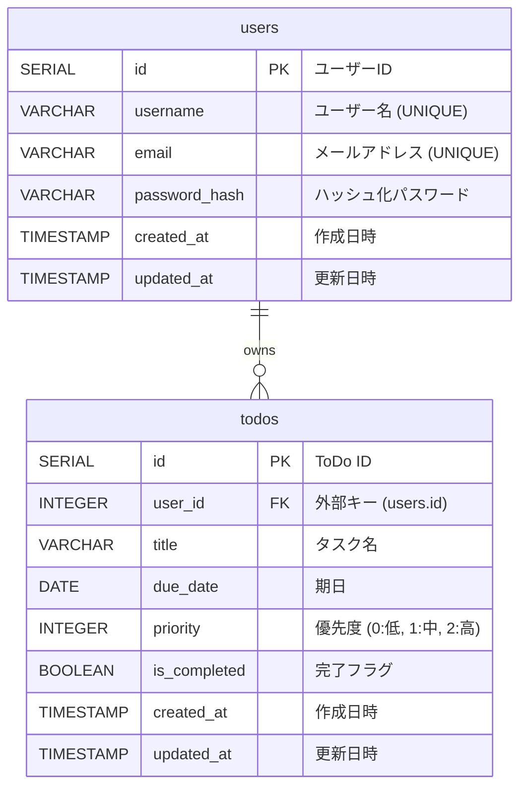

## 1. プロジェクト概要

技術ディスカッションのため、指定された仕様要件を満たすToDoアプリケーションを作成する。
目的としては形となるものを作成することを最優先にしていき、その後より良いアプリとするために拡張性を意識したコーディングを行なっていく。

## 2. 作成にあたってのルール（必須条件）

- 仕様要件をすべて満たしていること。
- ローカル環境で立ち上げが可能であること。
- ローカル環境での起動方法を整理した`README.md`をMarkdownで作成すること。

## コーディングの注意点
- 末尾（ファイルの最後の行の後）の改行を忘れないようにして下さい。

## 3. 機能要件

### 3.1. ユーザー管理機能

| 仕様要件番号 | 仕様 | 説明 | 補足 |
| --- | --- | --- | --- |
| 1 | ユーザー登録機能 | ユーザー名、パスワードを登録可能とする。<br>ただし、以下を満たす<br>・ユーザー名は一意であること<br>・パスワードは英数字どちらも含む8文字以上であること<br>・パスワードは暗号化して保持していること |  |
| 2 | ログイン機能 | ユーザー名とパスワードでログイン可能とする。<br>ログインに失敗した場合はエラーメッセージを表示する |  |
| 3 | ユーザー情報編集機能 | メールアドレス、ユーザー名、パスワードを変更できる |  |
| 4 | ログアウト機能 | ログイン中のアカウントをログアウトできるようにする |  |

### 3.2. ToDoリスト管理機能

| 仕様要件番号 | 仕様 | 説明 | 補足 |
| --- | --- | --- | --- |
| 1 | ToDo追加機能 | ToDo名、期日、優先度をToDoとして登録できる |  |
| 2 | ToDo一覧機能 | 登録したToDoは一覧で確認できる |  |
| 3 | ToDoの編集機能 | ToDo名、期日、優先度は一覧から編集できる |  |
| 4 | ToDoの削除機能 | ToDoは一覧から削除することができる |  |
| 5 | タスク完了、未完了のチェックボックス | チェックボックスでタスクの完了、未完了が区別できる | 完了したタスクはグレーアウト |
| 6 | タスクの並び替えができる | 期日順、優先度順でタスクを並び替えることができる |  |

## 4. 画面一覧・画面遷移

### 4.1. 画面遷移図 (Mermaid)

（タスク一覧では登録など削除、いろいろその画面で行える。）



### 4.2. 各画面の説明

| ファイル名 | 分類 | 説明 | 補足 |
| --- | --- | --- | --- |
| `top` | ログイン前画面 | ログアウトされた状態の画面 | リダイレクト先 |
| `login` | ログイン画面 | ログインする画面 | ユーザー認証 |
| `index` | 一覧表示画面 | ToDoの一覧表示とToDoの新規登録フォームを表示する<br>編集、削除、ソートも行える | 編集、削除、完了は別ページに切り出してもよい |
| `user` | ユーザー画面 | ユーザー情報を表示<br>ユーザー情報の編集ができる |  |

## 5. 機能要件チェックリスト

### ユーザー管理機能

- [ ]  **ユーザー登録機能**
    - [ ]  ユーザー名、パスワードを登録できる
    - [ ]  ユーザー名は一意である
    - [ ]  パスワードは英数字どちらも含む8文字以上である
    - [ ]  パスワードは暗号化して保持している
- [ ]  **ログイン機能**
    - [ ]  ユーザー名とパスワードでログインできる
    - [ ]  ログインに失敗した場合、エラーメッセージを表示する
- [ ]  **ユーザー情報編集機能**
    - [ ]  メールアドレス、ユーザー名、パスワードを変更できる
- [ ]  **ログアウト機能**
    - [ ]  ログイン中のアカウントをログアウトできる

### ToDoリスト管理機能

- [ ]  **ToDo追加機能**
    - [ ]  ToDo名、期日、優先度を登録できる
- [ ]  **ToDo一覧機能**
    - [ ]  登録したToDoを一覧で確認できる
- [ ]  **ToDo編集機能**
    - [ ]  ToDo名、期日、優先度を一覧から編集できる
- [ ]  **ToDo削除機能**
    - [ ]  ToDoを一覧から削除できる
- [ ]  **タスク完了/未完了**
    - [ ]  チェックボックスでタスクの完了/未完了を区別できる
    - [ ]  完了したタスクはグレーアウト表示される
- [ ]  **タスク並び替え機能**
    - [ ]  期日順でタスクを並び替えできる
    - [ ]  優先度順でタスクを並び替えできる

### 必須条件

- [ ]  全ての仕様要件を満たしている
- [ ]  ローカル環境で立ち上げが可能である
- [ ]  ローカル環境での起動方法を整理した`README.md`が作成されている

---

## 4. 技術選定とアーキテクチャ

### 4.1. テクノロジースタック

| 領域 | 技術/フレームワーク | 役割 |
| :--- | :--- | :--- |
| **バックエンド** | **Go (`net/http` 標準ライブラリ)** | APIサーバー、ビジネスロジック |
| **フロントエンド** | **Next.js (pnpm)** | UI、ユーザー体験 |
| **データベース** | **PostgreSQL** | データ永続化 |
| **環境構築** | **Docker / Docker Compose** | 開発環境のコンテナ化 |

### 4.2. アーキテクチャ設計 (クリーンアーキテクチャ)

バックエンドは、関心事の分離とテストの容易性を高めるため、クリーンアーキテクチャを採用します。依存関係は常に外側から内側へ向かい、中心のビジネスロジックは外部の技術詳細（DBやWebフレームワーク）から独立します。

```mermaid
graph TD
    subgraph "4. Frameworks & Drivers (具象)"
        D1[net/http Server]
        D2[PostgreSQL (pgx)]
    end
    subgraph "3. Interface Adapters (変換)"
        C1[Controllers / Handlers]
        C2[Repositories (DB実装)]
    end
    subgraph "2. Use Cases (ビジネスロジック)"
        U[Todoの作成、ユーザー登録など]
    end
    subgraph "1. Entities (中心的なオブジェクト)"
        E[User, Todo 構造体]
    end
    D1 --> C1; D2 --> C2;
    C1 --> U; C2 -- "implements" --> U;
    U --> E;
```

### 4.3. バックエンドのライブラリ選定

「フレームワークは使わず、必須かつ単機能のライブラリは限定的に採用する」方針に基づき、以下のライブラリを選定します。

| カテゴリ | ライブラリ（または標準パッケージ） | なぜ使うか？ |
| :--- | :--- | :--- |
| **HTTPサーバー** | **`net/http`** (標準) | GoのWeb開発の基礎を学ぶため。 |
| **DBドライバ** | **`jackc/pgx`** | DBとの通信に必須な低レベルな接続部品のため。 |
| **DBマイグレーション** | **`golang-migrate/migrate`** | 堅牢なスキーマ管理のための開発ツールとして利用。 |
| **データベース操作** | **`SQLC`** | SQLから型安全なGoコードを自動生成するため。 |
| **バリデーション** | **`go-playground/validator`** | データ検証ロジックの自作は複雑でリスクが高いため。 |
| **JWT** | **`golang-jwt/jwt`** | 暗号化関連の自作はセキュリティリスクが高いため。 |
| **パスワードハッシュ化** | **`bcrypt`** | Go公式拡張パッケージであり、安全なパスワード保護の標準であるため。 |
| **テスト** | **`testify/assert`** | テストコードの可読性と記述性を向上させるため。 |

-----

## 5. ディレクトリ構成

クリーンアーキテクチャの思想に基づき、バックエンドのディレクトリ構成を以下のように設計します。

```plaintext
todo-app/
│
├── 📁 backend/
│   ├── cmd/api/main.go      # 4. サーバー起動などインフラ層
│   └── internal/
│       ├── domain/            # 1. Entities (User, Todo構造体)
│       ├── usecase/           # 2. Use Cases (ビジネスロジック)
│       └── interface/         # 3. Interface Adapters
│           ├── controller/    # HTTPリクエストを処理
│           └── repository/    # DB操作のインターフェース
│
├── 📁 frontend/
│   └── (Next.jsの標準構成)
│
└── 📜 docker-compose.yml
```

-----

## DB設計

## DB設計 (PostgreSQL)

### 1. ER図 (Entity-Relationship Diagram)

データベースの全体像は、usersテーブルとtodosテーブルの2つで構成されます。

一人のユーザー（users）が、多数のToDo（todos）を所有できる一対多の関係になります。

コード スニペット



---

### 2. テーブル定義

### 2.1. `users` テーブル

ユーザー情報を管理するためのテーブルです。

| カラム名 | データ型 | 制約 | 説明 |
| --- | --- | --- | --- |
| `id` | `SERIAL` | `PRIMARY KEY` | ユーザーを一位に識別するID（自動採番） |
| `username` | `VARCHAR(255)` | `NOT NULL, UNIQUE` | ユーザー名。一意である必要があります。 |
| `email` | `VARCHAR(255)` | `NOT NULL, UNIQUE` | メールアドレス。ユーザー情報編集で使います。 |
| `password_hash` | `VARCHAR(255)` | `NOT NULL` | bcryptなどでハッシュ化されたパスワード |
| `created_at` | `TIMESTAMP WITH TIME ZONE` | `DEFAULT CURRENT_TIMESTAMP` | レコード作成日時 |
| `updated_at` | `TIMESTAMP WITH TIME ZONE` | `DEFAULT CURRENT_TIMESTAMP` | レコード更新日時 |

### 2.2. `todos` テーブル

各ユーザーのToDoタスク情報を管理するためのテーブルです。

| カラム名 | データ型 | 制約 | 説明 |
| --- | --- | --- | --- |
| `id` | `SERIAL` | `PRIMARY KEY` | ToDoを一位に識別するID（自動採番） |
| `user_id` | `INTEGER` | `NOT NULL, REFERENCES users(id) ON DELETE CASCADE` | どのユーザーのタスクかを示す外部キー |
| `title` | `VARCHAR(255)` | `NOT NULL` | タスクのタイトル |
| `due_date` | `DATE` | `NULL` | タスクの期日。未設定も許容します。 |
| `priority` | `INTEGER` | `NOT NULL, DEFAULT 0` | 優先度。**0:低, 1:中, 2:高** のようにアプリ側で解釈 |
| `is_completed` | `BOOLEAN` | `NOT NULL, DEFAULT FALSE` | タスクが完了したかどうか (true/false) |
| `created_at` | `TIMESTAMP WITH TIME ZONE` | `DEFAULT CURRENT_TIMESTAMP` | レコード作成日時 |
| `updated_at` | `TIMESTAMP WITH TIME ZONE` | `DEFAULT CURRENT_TIMESTAMP` | レコード更新日時 |

---

### 3. 補足

- **`ON DELETE CASCADE`**: `users`テーブルのレコードが削除された場合、そのユーザーに紐づく`todos`レコードも自動的に削除されるように設定しています。これによりデータの整合性を保ちます。
- **`updated_at`の自動更新**: PostgreSQLでレコードが更新された際に`updated_at`を自動で更新するには、別途トリガー関数を作成する必要があります。
- **インデックス**: パフォーマンス向上のため、`todos`テーブルの`user_id`カラム（外部キー）には自動的にインデックスが作成されます。また、ソート条件となる`due_date`や`priority`にもインデックスを作成することが推奨されます。
