# バックエンドアーキテクチャ詳細分析

## 🏗️ 全体アーキテクチャ

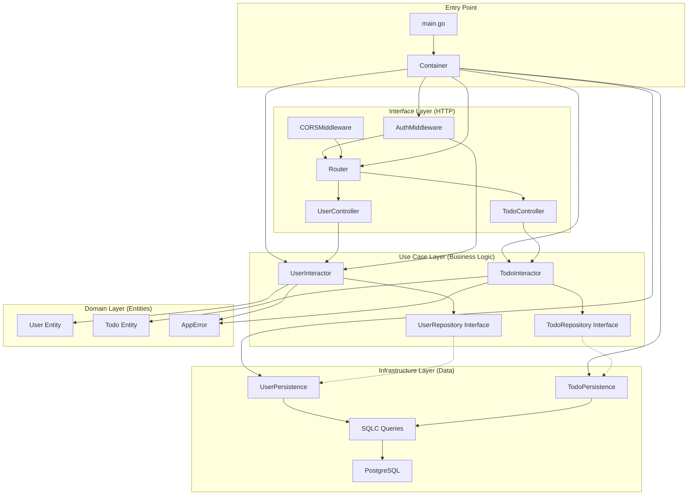

## 🔄 認証フロー詳細

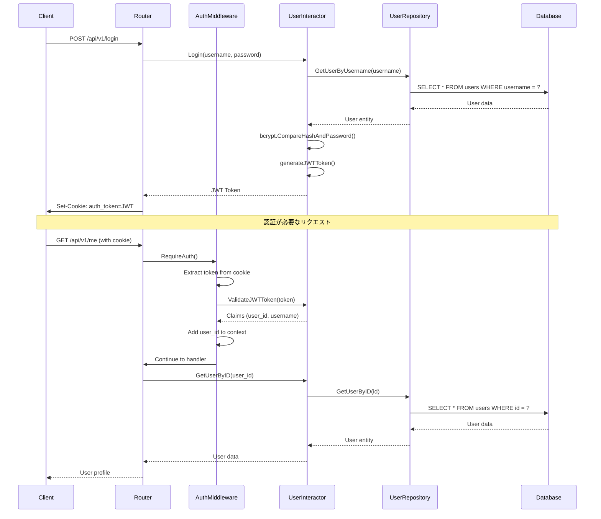

## ��️ データベーススキーマ

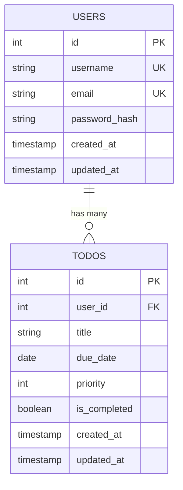

## �� 依存性注入（DI）の詳細

### Container構造

```go
type Container struct {
    // Infrastructure layer
    queries  *persistence.Queries
    userRepo usecase.UserRepository
    todoRepo usecase.TodoRepository

    // Use case layer
    userInteractor usecase.UserUseCase
    todoInteractor usecase.TodoUseCase

    // Interface layer
    userController *controller.UserController
    todoController *controller.TodoController
    authMiddleware *middleware.AuthMiddleware
    corsMiddleware *middleware.CORSMiddleware
    router         *router.Router
}

```

### DIの構築順序

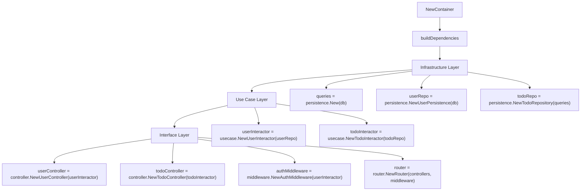

## 📁 ディレクトリ構造と責務

### 全体構造

```mermaid
graph TD
    A[backend/] --> B[cmd/api/]
    A --> C[internal/]
    A --> D[migrations/]
    A --> E[sqlc.yaml]
    A --> F[go.mod]

    B --> B1[main.go - アプリケーションエントリーポイント]

    C --> C1[domain/ - ドメイン層]
    C --> C2[usecase/ - ユースケース層]
    C --> C3[interface/ - インターフェース層]
    C --> C4[infrastructure/ - インフラストラクチャ層]

    C1 --> C1A[user.go - Userエンティティ]
    C1 --> C1B[todo.go - Todoエンティティ]
    C1 --> C1C[errors.go - アプリケーションエラー定義]

    C2 --> C2A[user_repository.go - UserRepositoryインターフェース]
    C2 --> C2B[user_interactor.go - ユーザー関連ビジネスロジック]
    C2 --> C2C[todo_repository.go - TodoRepositoryインターフェース]
    C2 --> C2D[todo_interactor.go - Todo関連ビジネスロジック]

    C3 --> C3A[controller/ - HTTPコントローラー]
    C3 --> C3B[middleware/ - HTTPミドルウェア]
    C3 --> C3C[router/ - ルーティング設定]
    C3 --> C3D[repository/ - SQLCクエリ定義]

    C3A --> C3A1[user_controller.go - ユーザー関連HTTPハンドラー]
    C3A --> C3A2[todo_controller.go - Todo関連HTTPハンドラー]

    C3B --> C3B1[auth_middleware.go - JWT認証ミドルウェア]
    C3B --> C3B2[cors_middleware.go - CORS設定]

    C3C --> C3C1[router.go - ルート定義]

    C3D --> C3D1[user.sql - ユーザー関連SQL]
    C3D --> C3D2[todo.sql - Todo関連SQL]

    C4 --> C4A[container/ - 依存性注入コンテナ]
    C4 --> C4B[persistence/ - データ永続化]

    C4A --> C4A1[container.go - DI設定]

    C4B --> C4B1[db.go - SQLC生成コード（DB接続）]
    C4B --> C4B2[models.go - SQLC生成コード（モデル）]
    C4B --> C4B3[user_persistence.go - ユーザー永続化実装]
    C4B --> C4B4[todo_persistence.go - Todo永続化実装]

    D --> D1[000001_create_users_table.up.sql]
    D --> D2[000001_create_users_table.down.sql]
    D --> D3[000002_create_todos_table.up.sql]
    D --> D4[000002_create_todos_table.down.sql]

```

### 各ディレクトリの詳細責務

### �� **cmd/api/** - アプリケーションエントリーポイント

- **main.go**: アプリケーションの起動点
    - データベース接続の確立
    - 依存性注入コンテナの初期化
    - HTTPサーバーの起動
    - 環境変数の読み込み

### 🏛️ **internal/domain/** - ドメイン層（ビジネスルール）

- **user.go**: ユーザーエンティティ
    - ユーザーの基本情報（ID、ユーザー名、メール、パスワードハッシュ）
    - 作成日時、更新日時
- **todo.go**: Todoエンティティ
    - Todoの基本情報（ID、タイトル、期限、優先度、完了状態）
    - ユーザーとの関連
- **errors.go**: アプリケーションエラー定義
    - 構造化されたエラー型（AppError）
    - 定義済みエラー（ユーザー関連、認証関連、バリデーション関連）

### 🔧 **internal/usecase/** - ユースケース層（ビジネスロジック）

- **user_repository.go**: ユーザーリポジトリインターフェース
    - データアクセスの抽象化
    - CRUD操作の定義
- **user_interactor.go**: ユーザー関連ビジネスロジック
    - ユーザー登録、ログイン、プロフィール更新
    - パスワードハッシュ化、JWT生成・検証
    - ビジネスルールの実装
- **todo_repository.go**: Todoリポジトリインターフェース
    - Todoデータアクセスの抽象化
- **todo_interactor.go**: Todo関連ビジネスロジック
    - TodoのCRUD操作
    - ユーザー権限チェック

### 🌐 **internal/interface/** - インターフェース層（外部との接続）

### **controller/** - HTTPコントローラー

- **user_controller.go**: ユーザー関連HTTPハンドラー
    - リクエストの受信・検証
    - レスポンスの生成
    - HTTPステータスコードの管理
    - クッキーの設定
- **todo_controller.go**: Todo関連HTTPハンドラー
    - TodoのCRUD操作のHTTPエンドポイント

### **middleware/** - HTTPミドルウェア

- **auth_middleware.go**: JWT認証ミドルウェア
    - トークンの検証
    - ユーザー情報のコンテキストへの追加
    - 認証が必要なルートの保護
- **cors_middleware.go**: CORS設定
    - クロスオリジンリクエストの許可
    - セキュリティヘッダーの設定

### **router/** - ルーティング設定

- **router.go**: ルート定義
    - URLパターンとハンドラーのマッピング
    - ミドルウェアの適用
    - 公開・非公開エンドポイントの分離

### **repository/** - SQLCクエリ定義

- **user.sql**: ユーザー関連SQLクエリ
    - ユーザーのCRUD操作
    - ユーザー名・メールでの検索
- **todo.sql**: Todo関連SQLクエリ
    - TodoのCRUD操作
    - ユーザー別Todo取得

### ��️ **internal/infrastructure/** - インフラストラクチャ層（技術的詳細）

### **container/** - 依存性注入コンテナ

- **container.go**: DI設定
    - 依存関係の構築順序
    - インターフェースと実装の紐付け
    - シングルトンパターンの管理

### **persistence/** - データ永続化

- **db.go**: SQLC生成コード（DB接続）
    - データベース接続の抽象化
    - トランザクション管理
- **models.go**: SQLC生成コード（モデル）
    - データベーススキーマに対応するGo構造体
    - JSONタグ付きの型定義
- **user_persistence.go**: ユーザー永続化実装
    - UserRepositoryインターフェースの実装
    - SQLC生成コードの活用
    - ドメインモデルへの変換
- **todo_persistence.go**: Todo永続化実装
    - TodoRepositoryインターフェースの実装
    - Todo関連のデータアクセス

### 🗄️ **migrations/** - データベースマイグレーション

- **000001_create_users_table.up.sql**: ユーザーテーブル作成
- **000001_create_users_table.down.sql**: ユーザーテーブル削除
- **000002_create_todos_table.up.sql**: Todoテーブル作成
- **000002_create_todos_table.down.sql**: Todoテーブル削除

### ⚙️ **設定ファイル**

- **sqlc.yaml**: SQLC設定
    - SQLファイルの場所指定
    - 生成コードの出力先
    - データベースエンジンの指定
- **go.mod**: Go依存関係管理
    - 外部パッケージのバージョン管理
    - モジュールパスの定義

## �� データフローとコードの流れ

### ユーザー登録の完全なフロー

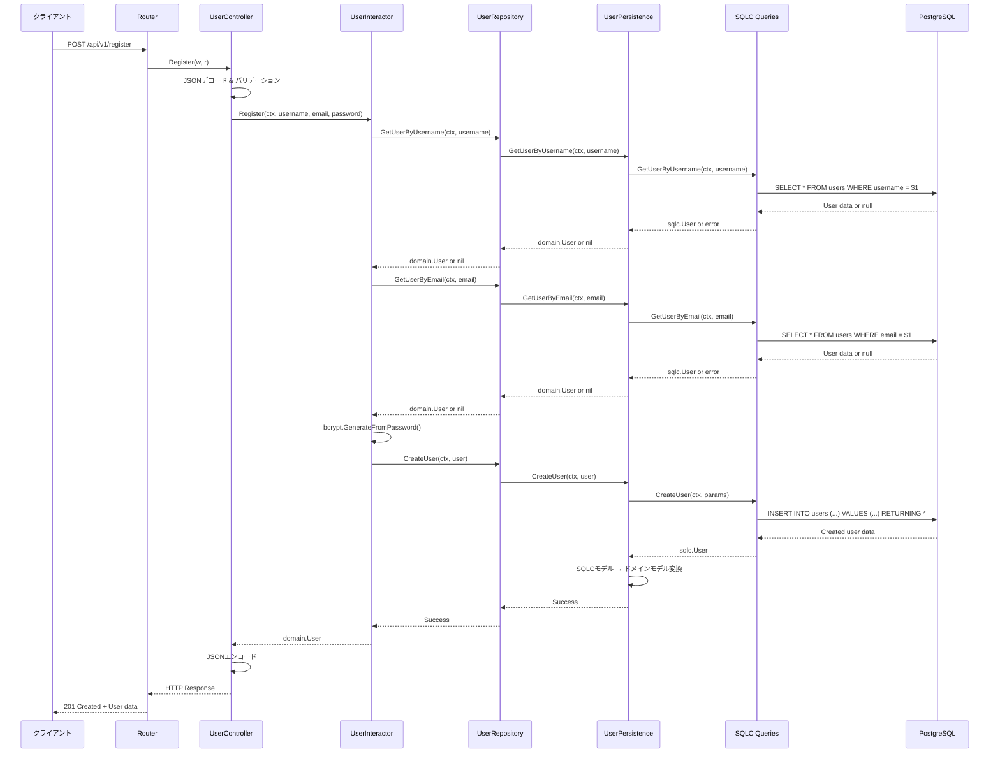

### 認証が必要なリクエストのフロー

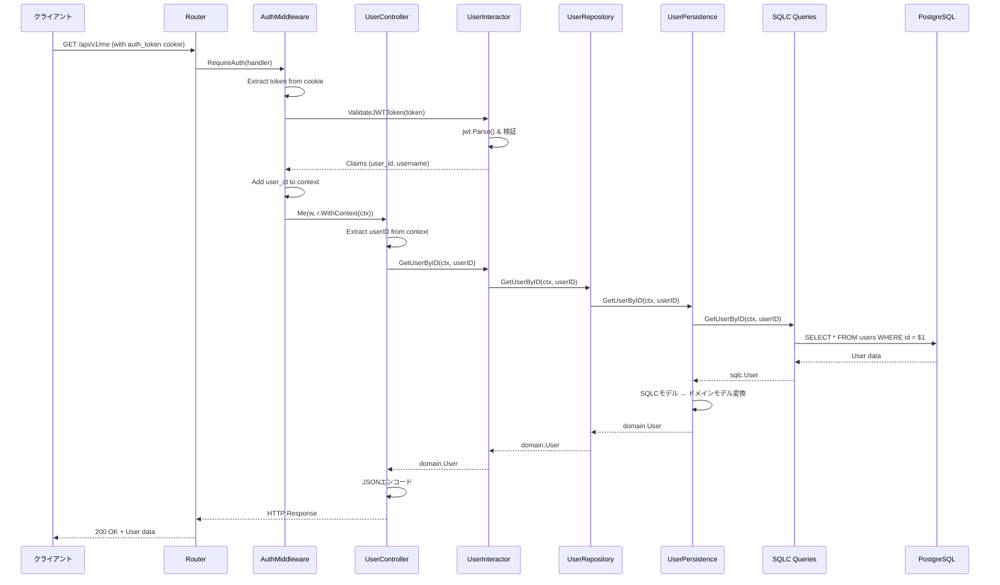

### 依存性注入の詳細フロー

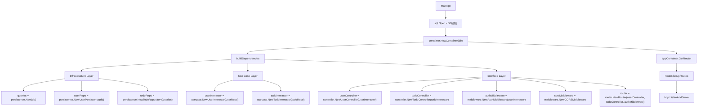

## 🔐 認証システムの詳細

### JWT Token構造

```go
claims := jwt.MapClaims{
    "user_id":  userID,           // ユーザーID
    "username": username,         // ユーザー名
    "exp":      time.Now().Add(24 * time.Hour).Unix(), // 24時間有効
    "iat":      time.Now().Unix(), // 発行時刻
}

```

### 認証ミドルウェアの動作

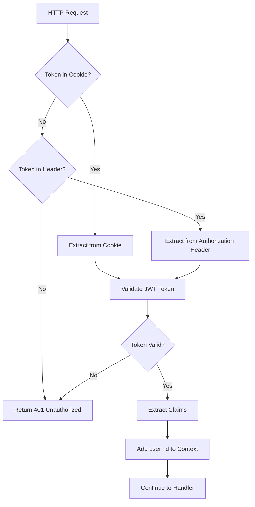

## 🗄️ データ永続化の詳細

### SQLC自動生成コードの活用

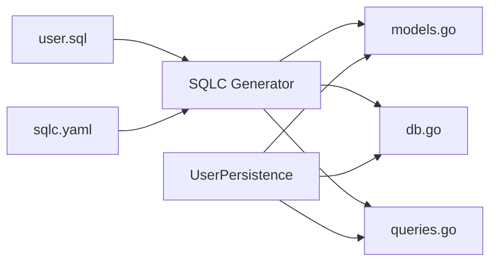

### 型安全性の確保

- **SQLC生成モデル**: `persistence.User`, `persistence.Todo`
- **ドメインモデル**: `domain.User`, `domain.Todo`
- **変換レイヤー**: Persistence層でSQLCモデル → ドメインモデル変換

## 🚀 起動フロー

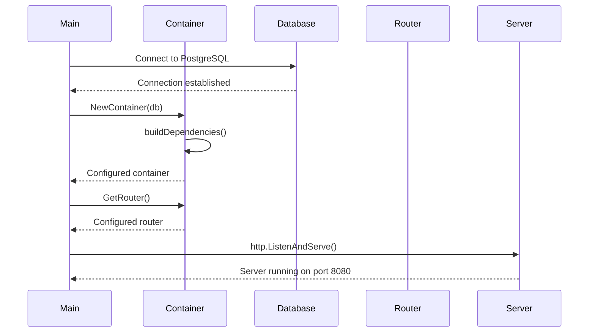

## 🔧 主要な型定義とインターフェース

### 型定義の階層構造

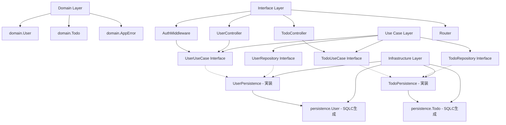

### 1. ドメインエンティティ

```go
// domain/user.go - ビジネスロジックの中核
type User struct {
    ID           int       `json:"id"`
    Username     string    `json:"username"`
    Email        string    `json:"email"`
    PasswordHash string    `json:"-"` // JSON出力から除外
    CreatedAt    time.Time `json:"created_at"`
    UpdatedAt    time.Time `json:"updated_at"`
}

// domain/todo.go - Todoエンティティ
type Todo struct {
    ID          int       `json:"id"`
    UserID      int       `json:"user_id"`
    Title       string    `json:"title"`
    DueDate     *time.Time `json:"due_date,omitempty"`
    Priority    int       `json:"priority"`
    IsCompleted bool      `json:"is_completed"`
    CreatedAt   time.Time `json:"created_at"`
    UpdatedAt   time.Time `json:"updated_at"`
}

```

### 2. リポジトリインターフェース（データアクセスの抽象化）

```go
// usecase/user_repository.go - ユーザーデータアクセス
type UserRepository interface {
    CreateUser(ctx context.Context, user *domain.User) error
    GetUserByUsername(ctx context.Context, username string) (*domain.User, error)
    GetUserByEmail(ctx context.Context, email string) (*domain.User, error)
    GetUserByID(ctx context.Context, id int) (*domain.User, error)
    UpdateUser(ctx context.Context, user *domain.User) error
}

// usecase/todo_repository.go - Todoデータアクセス
type TodoRepository interface {
    CreateTodo(ctx context.Context, todo *domain.Todo) error
    GetTodosByUserID(ctx context.Context, userID int) ([]*domain.Todo, error)
    GetTodoByID(ctx context.Context, id int) (*domain.Todo, error)
    UpdateTodo(ctx context.Context, todo *domain.Todo) error
    DeleteTodo(ctx context.Context, id int) error
}

```

### 3. ユースケースインターフェース（ビジネスロジック）

```go
// usecase/user_interactor.go - ユーザー関連ビジネスロジック
type UserUseCase interface {
    Register(ctx context.Context, username, email, password string) (*domain.User, error)
    Login(ctx context.Context, username, password string) (string, error)
    GetUserByID(ctx context.Context, userID int) (*domain.User, error)
    GetUserByUsername(ctx context.Context, username string) (*domain.User, error)
    UpdateProfile(ctx context.Context, userID int, username, email, currentPassword, newPassword string) (*domain.User, error)
    ValidateJWTToken(tokenString string) (*jwt.MapClaims, error)
    Logout(ctx context.Context, tokenString string) error
}

// usecase/todo_interactor.go - Todo関連ビジネスロジック
type TodoUseCase interface {
    CreateTodo(ctx context.Context, userID int, title string, dueDate *time.Time, priority int) (*domain.Todo, error)
    GetTodosByUserID(ctx context.Context, userID int) ([]*domain.Todo, error)
    GetTodoByID(ctx context.Context, userID, todoID int) (*domain.Todo, error)
    UpdateTodo(ctx context.Context, userID int, todo *domain.Todo) (*domain.Todo, error)
    DeleteTodo(ctx context.Context, userID, todoID int) error
}

```

### 4. SQLC生成モデル（データベーススキーマ対応）

```go
// persistence/models.go - SQLC自動生成
type User struct {
    ID           int32        `json:"id"`
    Username     string       `json:"username"`
    Email        string       `json:"email"`
    PasswordHash string       `json:"password_hash"`
    CreatedAt    sql.NullTime `json:"created_at"`
    UpdatedAt    sql.NullTime `json:"updated_at"`
}

type Todo struct {
    ID          int32        `json:"id"`
    UserID      int32        `json:"user_id"`
    Title       string       `json:"title"`
    DueDate     sql.NullTime `json:"due_date"`
    Priority    int32        `json:"priority"`
    IsCompleted bool         `json:"is_completed"`
    CreatedAt   sql.NullTime `json:"created_at"`
    UpdatedAt   sql.NullTime `json:"updated_at"`
}

```

### 5. エラーハンドリング（構造化エラー）

```go
// domain/errors.go - アプリケーションエラー
type AppError struct {
    Code     string                 `json:"code"`      // エラーコード
    Message  string                 `json:"message"`   // エラーメッセージ
    Details  map[string]interface{} `json:"details,omitempty"` // 詳細情報
    HTTPCode int                    `json:"-"`         // HTTPステータスコード
}

// 定義済みエラー（型安全）
var (
    // ユーザー関連エラー
    ErrUserNotFound       = NewAppError("USER_NOT_FOUND", "ユーザーが見つかりません", http.StatusNotFound)
    ErrUsernameExists     = NewAppError("USERNAME_EXISTS", "このユーザー名は既に使用されています", http.StatusConflict)
    ErrEmailExists        = NewAppError("EMAIL_EXISTS", "このメールアドレスは既に登録されています", http.StatusConflict)
    ErrInvalidCredentials = NewAppError("INVALID_CREDENTIALS", "ユーザー名またはパスワードが正しくありません", http.StatusUnauthorized)
    ErrPasswordHashFailed = NewAppError("PASSWORD_HASH_FAILED", "パスワードの暗号化に失敗しました", http.StatusInternalServerError)

    // Todo関連エラー
    ErrTodoNotFound     = NewAppError("TODO_NOT_FOUND", "Todoが見つかりません", http.StatusNotFound)
    ErrTodoUnauthorized = NewAppError("TODO_UNAUTHORIZED", "このTodoにアクセスする権限がありません", http.StatusForbidden)

    // 認証関連エラー
    ErrUnauthorized = NewAppError("UNAUTHORIZED", "認証が必要です", http.StatusUnauthorized)
    ErrTokenInvalid = NewAppError("TOKEN_INVALID", "無効なトークンです", http.StatusUnauthorized)
    ErrTokenExpired = NewAppError("TOKEN_EXPIRED", "トークンの有効期限が切れています", http.StatusUnauthorized)

    // バリデーション関連エラー
    ErrValidationFailed = NewAppError("VALIDATION_FAILED", "バリデーションエラーです", http.StatusBadRequest)
    ErrInvalidJSON      = NewAppError("INVALID_JSON", "無効なJSON形式です", http.StatusBadRequest)
)

```

### 6. 依存性注入コンテナ

```go
// infrastructure/container/container.go - DI管理
type Container struct {
    db *sql.DB

    // Infrastructure layer
    queries  *persistence.Queries
    userRepo usecase.UserRepository
    todoRepo usecase.TodoRepository

    // Use case layer
    userInteractor usecase.UserUseCase
    todoInteractor usecase.TodoUseCase

    // Interface layer
    userController *controller.UserController
    todoController *controller.TodoController
    authMiddleware *middleware.AuthMiddleware
    corsMiddleware *middleware.CORSMiddleware
    router         *router.Router
}

```

### 7. 型変換の流れ

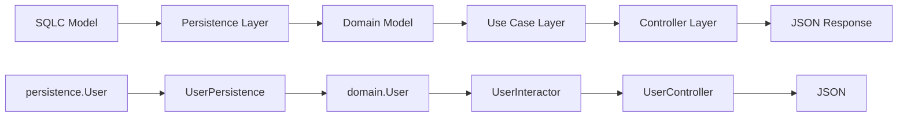

### 8. インターフェース実装の関係

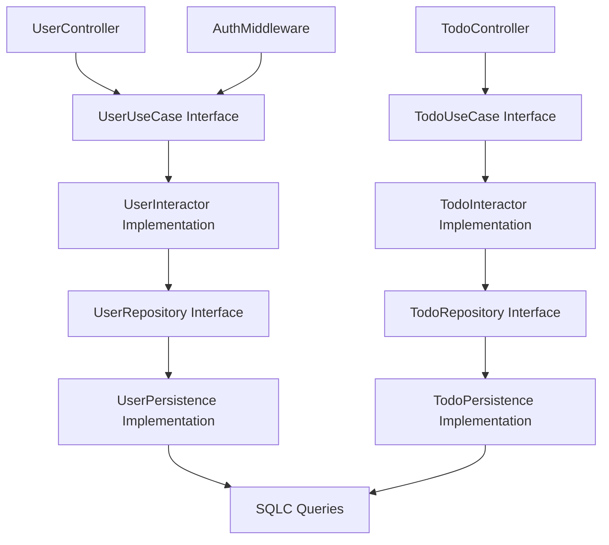

## �� 設計パターンとベストプラクティス

### 1. Clean Architecture

- **依存関係の方向**: 外側から内側へ（Interface → UseCase → Domain）
- **依存性逆転**: インターフェースによる抽象化
- **関心の分離**: 各層の責務を明確に分離

### 2. 依存性注入（DI）

- **Container パターン**: 依存関係の管理を一元化
- **インターフェース注入**: 実装の詳細を隠蔽
- **テスト容易性**: モック実装の注入が可能

### 3. 型安全性

- **SQLC**: SQLから型安全なGoコードを自動生成
- **ドメインモデル**: ビジネスロジックに特化した型定義
- **エラーハンドリング**: 構造化されたエラー型

### 4. セキュリティ

- **JWT認証**: ステートレスな認証方式
- **パスワードハッシュ**: bcryptによる安全なハッシュ化
- **CORS設定**: 適切なクロスオリジン設定
- **入力検証**: サーバーサイドでの厳密な検証
